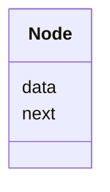
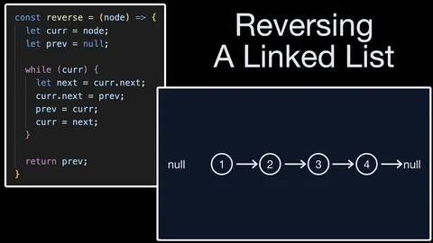

# Algorithms and Data Structures - Linked List

## Singly Linked List

**Node:**

**Linked List:**

## Demos:
- [Singly Linked List](./src/singly_linked_list.py)
- [Singly Linked List Operations](./src/singly_linked_list_operations.py)
- [Singly Linked List Operations Optimized](./src/singly_linked_list_operations_optimized.py) -> Some operations are optimized to O(1) time complexity. Example. Adding a node to the end of the list, length of the list.
- [Rotate Linked List](./src/rotate_linked_list.py)
- [Fast and Slow Pointer](./src/fast_and_slow_pointer.py)
- [Identifying Cycles](./src/identifying_cycles.py)
- [Floyd Cycle](./src/floyd_cycle.py)

### Rotating a Linked List

