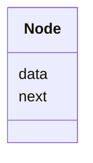
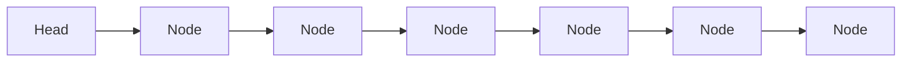

# Algorithms and Data Structures - Linked List

## Singly Linked List

**Node:**

```mermaid
classDiagram
    class Node {
        data
        next
    }
```

**Linked List:**

```mermaid
graph LR
    A[Head] --> B[Node]
    B --> C[Node]
    C --> D[Node]
    D --> E[Node]
    E --> F[Node]
    F --> G[Node]
```
